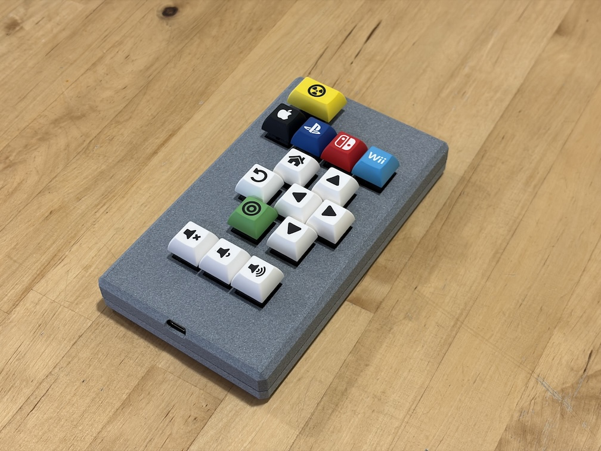

# Couch Clicker Atomic

The keyboard for your couch.

Couch Clicker Atomic is a Bluetooth, mechanical key, home theater remote control designed for use with [Amity](https://github.com/retsyx/amity) - home theater control over HDMI-CEC that works! (really)

Watch the video

## Using Couch Clicker Atomic

Couch Clicker Atomic works with Amity like any other compatible remote. To read more about Amity and its operation, visit the [Amity page](https://github.com/retsyx/amity).

To clear Couch Clicker Atomic's Bluetooth pairing and to re-pair, press and hold the `Power` and `Volume Up` buttons for 6 seconds.

To reset Couch Clicker Atomic, press and hold the `Power` and `Mute` buttons for 6 seconds.

## It's a Keyboard

Couch Clicker Atomic is really just a standard wireless Bluetooth keyboard. It may work (with some customization) with other home theater devices that have bluetooth remote controls that are really keyboard devices, like Google TVs or Amazon Fire TVs.

## Hardware

### PCB

The remote is based on a Seeed Studio XIAO nRF52840 board. The PCB design and manufacturing files are [here](other/hardware/board).

### Keycaps

A sample design file to get your own keycaps from [Yuzu Keycaps](https://yuzukeycaps.com) is available [here](other/keycaps/yuzu.json).

### 3D Printed Case

STEP files for a 3D printed case are available [here](other/case).

### LiPo Battery

A LiPo with a JST 2 connector that fits in the case should work. The battery should be at most 10mm thick, and 30mm wide. Ensure the battery leads in the connector are the same polarity as the connector on Couch Clicker Atomic. If they are not, battery connector pins can be easily pried out with a utility knife to reverse their position in the connector.

[This LiPo battery](https://www.amazon.com/dp/B0CNLNZFQL) works well.

## Firmware

### ZMK

Download the ZMK firmware from [here](). Install it using the standard ZMK installation method - [documented here](https://zmk.dev/docs/user-setup#install-the-firmware).

When the remote is fully assembled in the case, to reset ZMK to the bootloader, to allow updating the firmware, press and hold the `Power`, `Select` and `Back` buttons for 10 seconds.

Couch Clicker Atomic ZMK code is licensed under the [MIT license](MIT-LICENSE.md).

### KMK

Alternatively, you may prefer to use a CircuitPython based firmware with KMK. Code and instructions for installing KMK are [here](other/kmk).

Couch Clicker Atomic KMK code is licensed under the [GPLv3 license](GPLv3-LICENSE.md).
