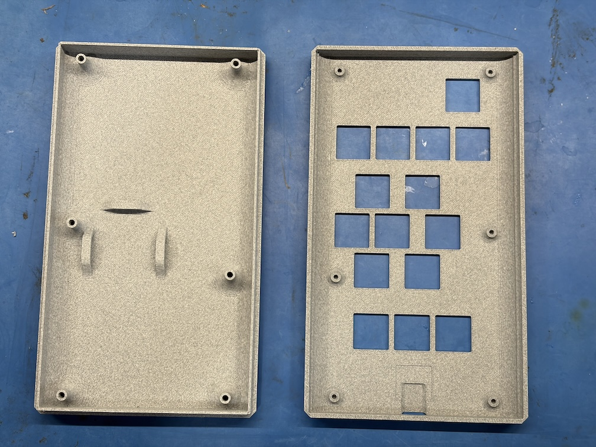

# Couch Clicker Atomic 3D Printable Case

* [Case Top](case-top.step)
* [Case Bottom](case-bottom.step)

## Printing

Print without supports. Use 6x 18mm M2.5 hex socket head machine screws.

## Assembly

1. In the bottom case part, remove the sacrifical layer in the screw holes by placing a screw in the hole from the inside and gently tapping it with a mallet to break the layer. Pull out the screw and remove any remaining plastic bits from the other side. Ream the screw head holes with the hex key for the screws to ensure no plastic remains.
2. In the bottom case part, insert a length of hook and loop cable wrap tape through the battery bridges to hold the battery.
3. Slide the USB-C port through the top case cover hole, and push the PCB switches through the top case cover holes.
4. Attach the battery to the PCB.
5. Fasten the battery to the bottom case with the hook and loop tape.
6. Press the case parts together, and fasten the screws.
