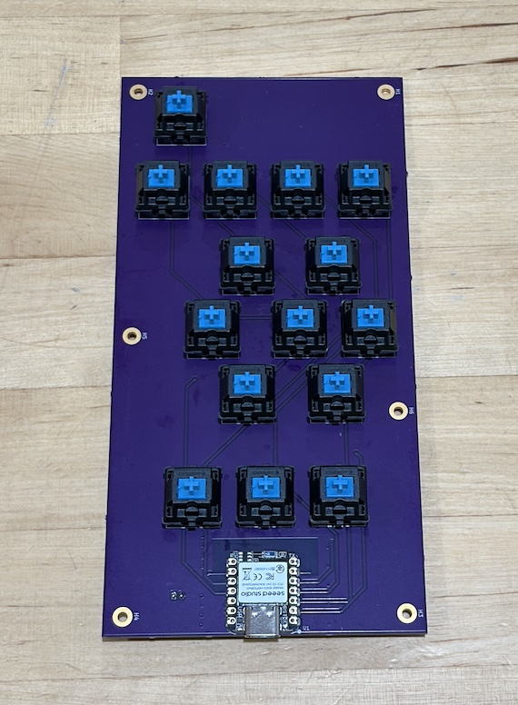

# Couch Clicker Atomic PCB

Gerber files and an example BOM file are in the [mfr folder](board/mfr/).

## BOM

* 1x [Seeed Studio XIAO BLE nRF52840](https://www.seeedstudio.com/Seeed-XIAO-BLE-nRF52840-p-5201.html)
* 15x [Cherry MX key switches, or similar, PCB mount](https://www.digikey.com/en/products/detail/cherry-americas-llc/MX1A-E1NW/20180)
* 15x [1N4148W diodes](https://www.digikey.com/en/products/detail/anbon-semiconductor-int-l-limited/1N4148W/17284377)
* 1x [JST 2.0 Connector](https://www.digikey.com/en/products/detail/jst-sales-america-inc/S2B-PH-K-S/926626)